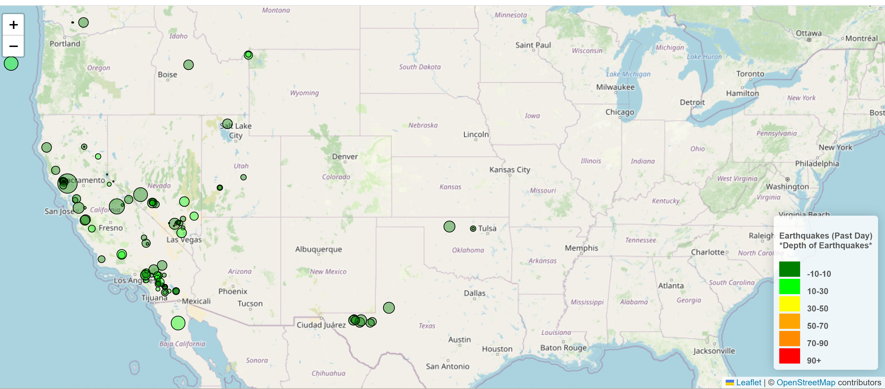

# Module 15 Challenge: Leaflet

## Description
Interactive Map that visualizes USGS's earthquake data in the past day

## Table of Contents
- [Installation](#installation)
- [Usage](#usage)
- [Credits](#credits)

- [Features](#features)

- [Contact](#contact)

## Installation
HTML, JS D3, CSS, & Leaftlet

## Usage
As a website

## Credits
Paola VdW. The Dataset was created by the United States Geological Survey

## Features
TitleLayer Map with Markers with size corresponding to earthquake magnitude. A legend is included showing the depth of the earthquakes and their corresponding color 

## Contact
If there are any questions or concerns, I can be reached at:
##### [github: paolavdw](https://github.com/paolavdw)
##### [email: paola.guigou@gmail.com](mailto:paola.guigou@gmail.com)
